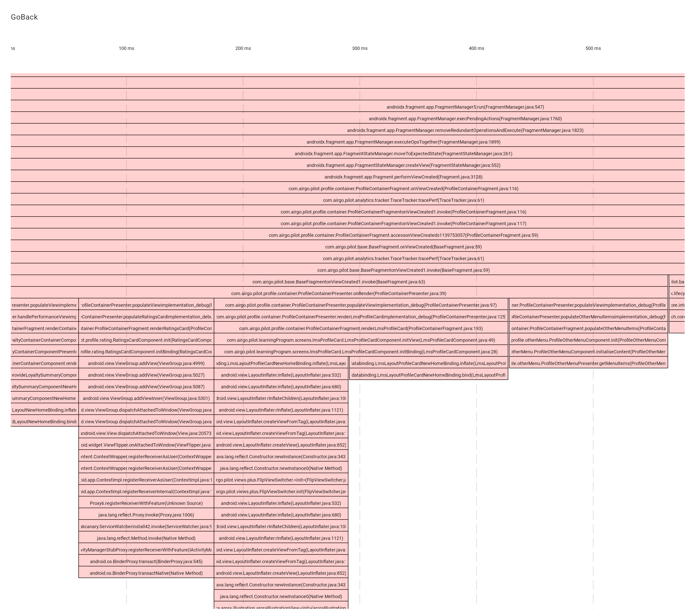

## Backstory
While working on a project, I needed to visualize a collection of stack traces. During my exploration of existing solutions, I found Brendan Gregg's  [FlameGraph](https://github.com/brendangregg/FlameGraph?tab=readme-ov-file). However, it didn't quite address my specific needs.

## Why not FlameGraph
FlameGraph was designed to visualize the performance of backend applications in a multithreaded environment. On the x-axis of a FlameGraph, function calls from multiple threads are mostly merged into one. This approach is perfect for applications with many threads. However, for applications where the focus is primarily on a single thread's behavior, such as the Android main thread, it would be more useful to represent time on the x-axis. Google Chrome's dev tool offers a feature called FlameChart that addresses this need for web applications.

## Project Purpose
This project aims to create a similar visualization tool for Android. While I could have written an adapter for Chrome's dev tool or PerfettoUI, I also wanted to explore the current state of WASM and Compose Multiplatform for some time now. This project seemed like a great opportunity to do so.

## Disclaimer:
This repository is a work in progress. The primary goal at this stage is to just make it work. It is not intended as a resource for learning KMP or Compose Multiplatform.

## Current state:
